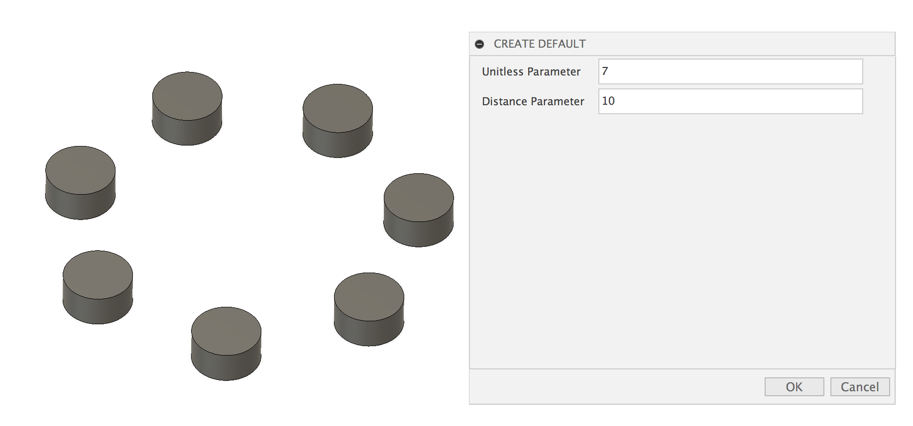
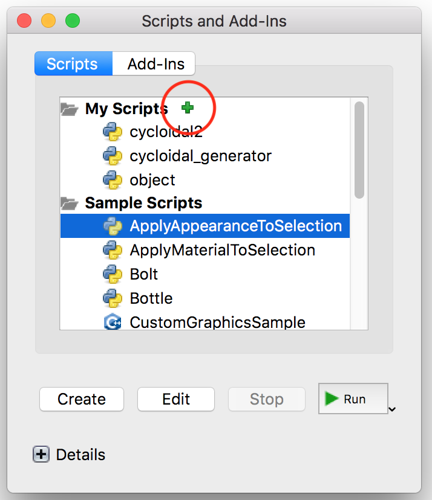

# Fusion API Template

Are you trying to create a Fusion script but can't seem to get over the complexity of Fusion's API? Are you annoyed that Fusion has nearly no good documentation and seems to write Python as if it was JavaScript in all their own examples? Do you need a simple way to get up and running on programmatic modelling?

Then this template might be for you...

This template makes it so that anyone can quickly and easily get started with Fusion scripting without having to know anything about the way the Fusion dialog box or API calls work and get right to whatever it is you want to make without any programmatic overhead.

## How to use it

Open object.py and follow the instructions to start creating your script. Add your input parameters and features and see how it works. If you have never made a Fusion script before I would recommend running object.py first the way it is and then trying to understand how it works. The default code creates a circular pattern or pillars that respond to parameters. From there start adding your own components and features.

Here is what the code does now:

## How to import a module

To import a module into Fusion type s and then type scripts into the box that pops up. Click on Scripts and Add-Ins then press the little green plus next to My Scripts. Navigate to the folder which contains object.py and click open. Now select object from My Scripts and click run.

## Resourses

The Fusion documentation is pretty bad when it comes to doing anything even remotely complicated, so here is a list of resoursed that might help:

[Fusion API forum (best resource)](https://forums.autodesk.com/t5/fusion-360-api-and-scripts/bd-p/22)

[Fusion API documentation (not great but complete) ](http://help.autodesk.com/view/fusion360/ENU/?guid=GUID-A92A4B10-3781-4925-94C6-47DA85A4F65A)

Note: A lot of the Fusion examples (including the one this is based on) seem to have basically taken javascript and shoved it forcefully into python without regard to the miserable code quality consequences. If you are copying code from official Fusion python libraries it likely has a heinous number of global variables and useless methods which make it very difficult to use. I would recommend using non Fusion code whenever possible.

## Editing the internals

If you want to dive deeper into the way this works, all the code that does the background part can be found in fusionUtils/\_\_init__.py. I tried to move as much of this away from the main document as possible to simplify the experience, but it would all work just as well in the main file. It basically defines the three types of handler Fusion relies on to create objects as well as a run function that manages calling them and a system to store and programmatically recall parameters so you don't have to type out the parameter name 10000 times. If you have any ideas to improve this section or there is something I missed, let me know with an issue or pull request.

